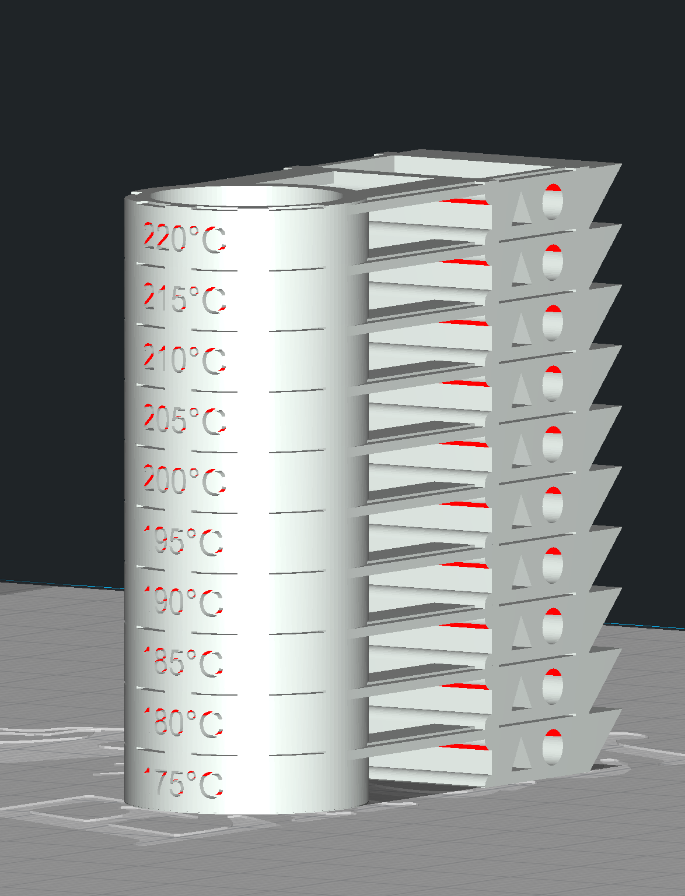

# Prints used during setup

These prints are used during my setup of the 3d printers.

## Temperature Tower

https://www.thingiverse.com/thing:2518236

This print is used when working with new filament. It will printat tempaeratures from 175c - 220c.  This tests for the best printing temperature for the filament.

## Files
Cura Files:
- [Temperature Tower](files/temperature_tower.3mf) 

GCode Files:
- [Temperature Tower](files/temperature_tower.gcode) (Print time: 1:30)

## Note
Originally Licensed under

Creative Commons (4.0 International License)
Attribution-NonCommercial